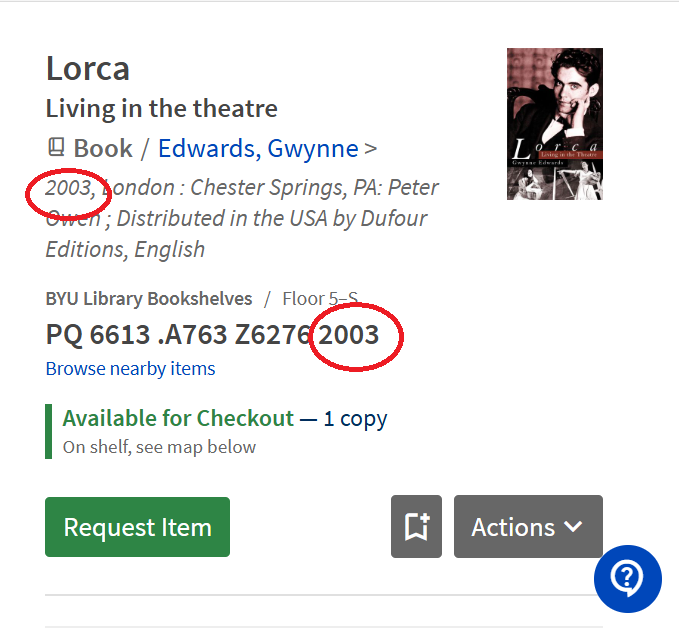
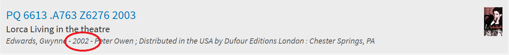

# Curiosity Report: Date objects in Web UI Rendering and Databases

- **Topic:** Investigating off-by-one year bugs caused by date parsing, timezone differences, and data transfer in web apps.

## 1. Background:

- **Why I chose this topic:** I currently work in the BYU library, where I'm constantly using the catalog website. Said website has many bugs and problems; one of which is that the publication date of ALL of the books in the catalog appears as exactly one year earlier in certain parts of the website. However, in the catalog view of the book the year is displayed correctly. <br>
I observed inconsistent year values between two views of the same content (individual page vs. scrolling list view), and I wanted to understand why this happens. I'm not even sure if this is a date parsing issue, or just a simple javascript integer error. However, I want to understand the error itself, and how QA/DevOps practices can potentially prevent it.

- **Examples:**
    - Here we see the Correct year is 2003. (backed up by a quick web search)
        - 
    - However, the image below shows the exact same item in the catalog's list view. We see that the year described is 2002: One year earlier than it should be.
        - 
    - This isn't just a fluke, either. This particular error happens with every single book in the HBLL website. Therefore, I want to understand why it happens, and find a fix for it. (even though I won't be able to do anything about it...)

## 2. Question I Wanted to Answer

- Why can the same data show a different year in different parts of the same website?
- Where is the date coming from, and how is it getting from the database to the frontend?
- Where is the mismatch happening?
    - is there a typo somewhere in javascript code?
    - is it a data/time error caused by date parsing?
    - are there two different dates stored for each item in the database?
- What is the best solution for this particular case?
- How can I reliably test and prevent this regression in CI/CD?

## 3. Background Research

- **Date objects in JavaScript**<br>
    - Source: [Mozilla MDN: Date Objects in Javascript](https://developer.mozilla.org/en-US/docs/Web/JavaScript/Reference/Global_Objects/Date)

    I first had to do a deep dive on exactly how date parsing works in javascript. <br>
    Date objects store a single instant as milliseconds called a timestamp. Various methods then interpret that timestamp as needed. <br>

    As I continued reading this source, I found the following information: <br>
    "...timestamp 0 represents a unique instant in history, but it can be interpreted in two ways: 
    - As a UTC time, it is midnight at the beginning of January 1, 1970, UTC,
    - As a local time in New York (UTC-5), it is 19:00:00 on December 31, 1969."<br>

    After considering the error in the HBLL website, I realized that the error described is only seen in cases where the date contains ONLY a specific year (no month or day). This now seems like a very plausible reason for the error.

    - Source: [Mozilla MDN: DateTimeFormat](https://developer.mozilla.org/en-US/docs/Web/JavaScript/Reference/Global_Objects/Intl/DateTimeFormat)

        ```javascript
        const date = new Date(Date.UTC(2020, 11, 20, 3, 23, 16, 738));
        // Results below assume UTC timezone - your results may vary

        // Specify default date formatting for language (locale)
        console.log(new Intl.DateTimeFormat("en-US").format(date));
        // Expected output: "12/20/2020"

        // Specify default date formatting for language with a fallback language (in this case Indonesian)
        console.log(new Intl.DateTimeFormat(["ban", "id"]).format(date));
        // Expected output: "20/12/2020"

        // Specify date and time format using "style" options (i.e. full, long, medium, short)
        console.log(
        new Intl.DateTimeFormat("en-GB", {
            dateStyle: "full",
            timeStyle: "long",
            timeZone: "Australia/Sydney",
        }).format(date),
        );
        // Expected output: "Sunday, 20 December 2020 at 14:23:16 GMT+11"

        ```

### 3.1 Core concepts to understand

- Layout of the HBLL website
- ISO date formats (`YYYY-MM-DD`, `YYYY-MM-DDTHH:mm:ssZ`)
- Local time vs UTC
- JavaScript `Date` parsing behavior
- Date formatting via `Intl.DateTimeFormat`
- Off-by-one errors at day/year boundaries

### 3.2 Sources consulted

- Source 1: [MDN Web Docs: Date](https://developer.mozilla.org/en-US/docs/Web/JavaScript/Reference/Global_Objects/Date)
- Source 2: [MDN Web Docs: Intl.DateTimeFormat](https://developer.mozilla.org/en-US/docs/Web/JavaScript/Reference/Global_Objects/Intl/DateTimeFormat)
- Source 3: [MDN Web Docs: Date.parse](https://developer.mozilla.org/en-US/docs/Web/JavaScript/Reference/Global_Objects/Date/parse)
- Source 4: [ISO 8601 date and time format](https://www.iso.org/iso-8601-date-and-time-format.html)

## 4. Experiment Setup

### 4.1 Hypothesis

- If one view parses/prints dates in local time and another in UTC (or with different input formats), the displayed year can differ by one near year boundaries. The HBLL website experiences this with all of their books, leading to misinformation and confusion. 

### 4.2 Reproduction plan

- Compare the date source and formatting logic used in:
  - Individual book page
  - Scroll/list books page
- Test the same records with dates near year boundaries.
- Test other pages that use similar MARC files and cataloging, see if result stays the same. 

### 4.3 Test data

- Reviewed the saved HBLL browse page HTML snapshot.
- Checked the linked frontend bundle and environment file for the browse app.
- Confirmed the browse page uses `https://apps.lib.byu.edu/alphabrowse-api/`.
- Inspected the rendered browse entry for a known book where the call number year and displayed year are both 2003 but the browse metadata year is 2002.
- Traced the UI code and found that the metadata display is assembled from backend fields and not calculated in the browser.
- Queried the browse API directly and confirmed it returns `date: 2002` for that record.
- Tried the same book in WorldCat to compare the catalog record against a third-party library source.
- Reviewed the MARC record fields, especially `008`, `050`, and `260`, to see which year the cataloging data actually supports.
- Reviewed the record JSON for the same book and checked `publicationDate`, `citations`, `orange.date_s`, and `holdings.callNumber`. 
    - ```json
      "fullTitle": "Lorca : living in the theatre / Gwynne Edwards.",
        "physicalDescription": "240 p., [16] p. of plates: ill., ports.; 23 cm.",
        "pageCount": 240,
        "publishers": [
            {
            "name": "Peter Owen ; Distributed in the USA by Dufour Editions",
            "location": "London : Chester Springs, PA"
            }
        ],
        "publicationDate": "2003",
        "isbns": [
            "0720611482"
        ],
        "oclcId": "50215573",
        "requestable": true,
        "languages": [
            {
            "id": "eng"
            ...
        ```
- Attempted to open the individual record page, but it redirected to Keycloak authentication, so the page contents could not be inspected directly without authorization. 

## 5. Results

### 5.1 Observations

- The browse list is not calculating the year in the browser; it is rendering backend-provided metadata.
    - This makes it especially hard for me to trace.
- The browse list consistently shows the call-number value ending in 2003, but the metadata line shows 2002.
    - In the saved HTML snapshot, the entry for the book is rendered as `PQ 6613 .A763 Z6276 2003` and `Edwards, Gwynne - 2002 - ...`.
    - The bundle shows that the `metadata` pipe simply prints `n.date` from the API response, so the 2002 is coming from the backend browse field, not from any browser-side date formatting.
- The MARC file supports a 2003 publication year: `008` includes `s2003`, `050` ends in `2003`, and `260 $c` is `2003`.
- The record JSON also supports 2003: `publicationDate` is `2003`, `citations.refworks` says `YR 2003`, `orange.date_s` is `2003-01-01T00:00:00Z`, and `holdings.callNumber` ends in `2003`.
- WorldCat was intended as a cross-check, and the accessible snapshot showed `datePublished: 2003` plus ISBN `0720611482`.
- The mismatch then, is coming from the browse index or backend mapping, not from frontend timezone formatting.

### 6.2 Root cause

- The browse list is consistently combining two different backend values: the call-number string still ends in 2003, and the date of publication (which is also 2003) comes from different data regarding time and place of publication. But the metadata line is fed by the API's `date` field, which is 2002. This explains the difference in date throughout the catalog. 
- That means the browse index is probably using an older or derived date field for display, even though the authoritative record data says 2003.
- It could also mean that there is a simple coding error in the backend where the date is stored as an integer and losing 1 from its value. 
- The frontend for this particular value is just displaying what the API sends, so the bug starts in backend data mapping or indexing.

### 6.3 Fix strategy & Reproduction

- Compare the browse API response against the full record JSON for the same title and verify whether the browse `date` field always disagrees with `publicationDate`.
- Go through the browse index mapping for the field that feeds the metadata line and confirm why it is returning 2002 while the call-number suffix still shows 2003.
- Find which backend field populates the browse `date` value and confirm whether it should use the same source as `publicationDate`.
- Add a regression test that checks the browse API returns 2003 for this record, not 2002.
    - For other records, the correct year is the one gathered from the MARC file, WorldCat, and the full record JSON.

## 7. QA and DevOps Implications

### 7.1 QA lessons

- Add explicit tests for date boundaries (end of month/year).
- Include timezone-sensitive tests.
- Create regression tests for previously failing cases.

### 7.2 DevOps lessons

- Run CI tests in a controlled timezone (for example UTC).
- Optionally run a matrix test in multiple timezone environments.
- Add linting or code review checks around date handling conventions.

### 8. Conclusion:

While I would like to say that I was successful in finding the issue and implementing a solution, I ultimately was not. However, I learned a LOT about javascript, backend calls, and data transfer from backend to frontend. I realize how easy it can be to miss such a simple detail like this, but it's also important to find the solution so the error no longer persists. In the case of the HBLL, this error has existed for at least a year (that's how long I've been working there), and I seem to be the only one who's noticed it (which means it must not be a huge issue).

My concluding hypothesis is that the browse page is taking two or three different backend values for the same item: the call-number display still reflects 2003, as does the publication year, while the metadata line is pulled from the browse API’s date field, which is showing 2002. Since WorldCat, the MARC record, and the full JSON record all agree on 2003, the problem is probably in the browse index or backend field mapping, not in the frontend. It seems to be ONLY that value that's affected.

In short: the record data is correct, the list view is showing the wrong year, and the mismatch is happening before the browser ever renders it. The best next step would be to check which backend field is feeding the browse date value and why it does not match publicationDate. I will continue my research until I have a full understanding of this phenomenon.